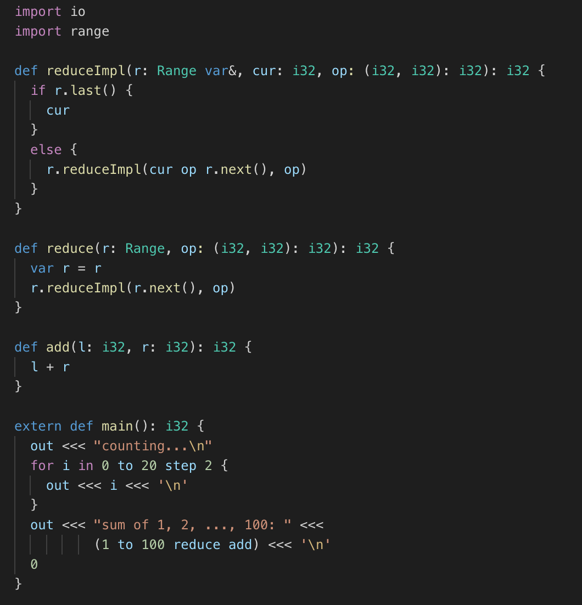

# YuLang VSCode Extension

Extension of the Yu programming language ([YuLang](https://github.com/MaxXSoft/YuLang)) for Visual Studio Code.

## Features

* Basic syntax highlighting for `.yu` files
* Code snippets

## Copyright & License

Copyright (C) 2010-2020 MaxXing. License MIT.
